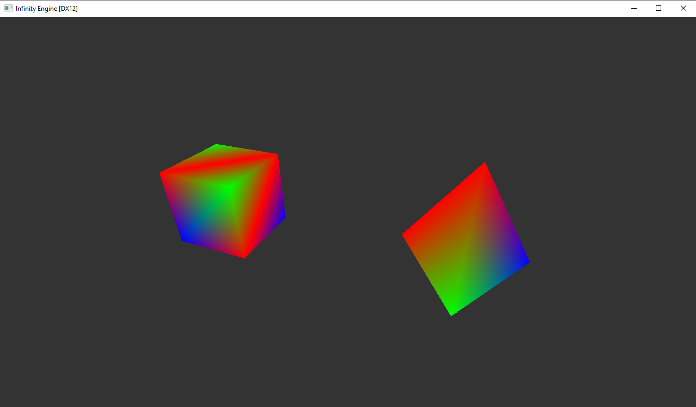

# Infinity Engine
Infinity Engine é um renderizador de gráficos tridimensionais em tempo real. Encontra-se em fase de desenvolvimento. Roda apenas no sistema operacional Windows com placas de vídeo com suporte à DirectX 12.

## Estado atual do Projeto
* Implementação da câmera - no vertex shader do [pipeline gráfico](https://docs.microsoft.com/en-us/windows/win32/direct3d11/overviews-direct3d-11-graphics-pipeline), são realizadas três transformações lineares: *model transform*, *view transform* e *projection transform*. A primeira transforma coordenadas do espaço do modelo para espaço do mundo, a segunda leva as coordenadas do espaço do mundo para espaço da câmera e, finalmente, a última leva as coordenadas do espaço da câmera para o volume de visualização (*viewing frustum*). Para mais detalhes, acesse [Transforms](https://docs.microsoft.com/pt-pt/windows/uwp/graphics-concepts/transforms).

## Próximas etapas do projeto
* Modelo de Phong da reflexão especular
* Mapeamento de texturas
* Importação de modelos
* *Shadow Mapping*

### Sobre o Direct3D 12

Lançado em 29 de julho de 2015 no Windows 10 e no Xbox One, o Direct3D 12 é uma API de baixo nível que permite a utilização plena do hardware das GPUs mais modernas do mercado. De acordo com a documentação da Microsoft, o D3D12 é mais rápido e mais eficiente do que qualquer versão anterior. Permite a criação de cenas mais ricas, com mais objetos e efeitos mais complexos. Para mais informações, acesse https://docs.microsoft.com/en-us/windows/win32/direct3d12/direct3d-12-graphics.
